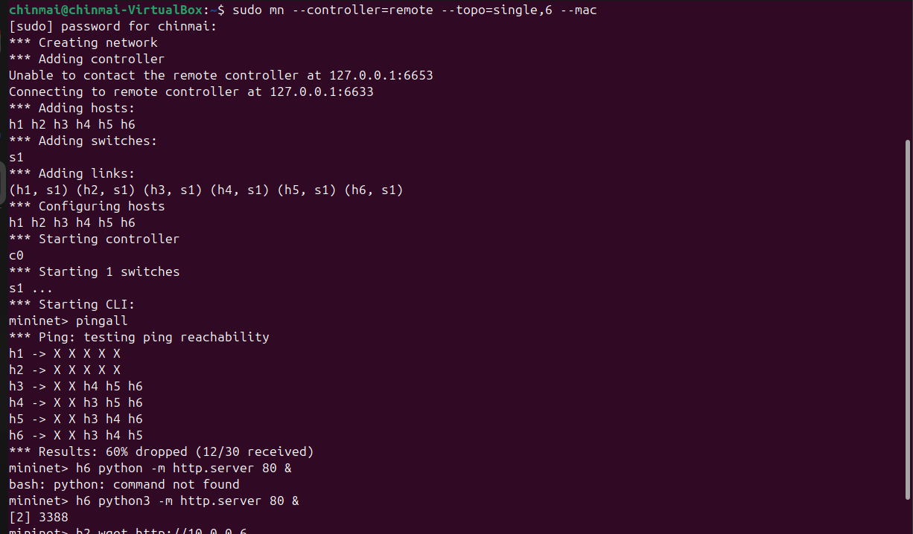
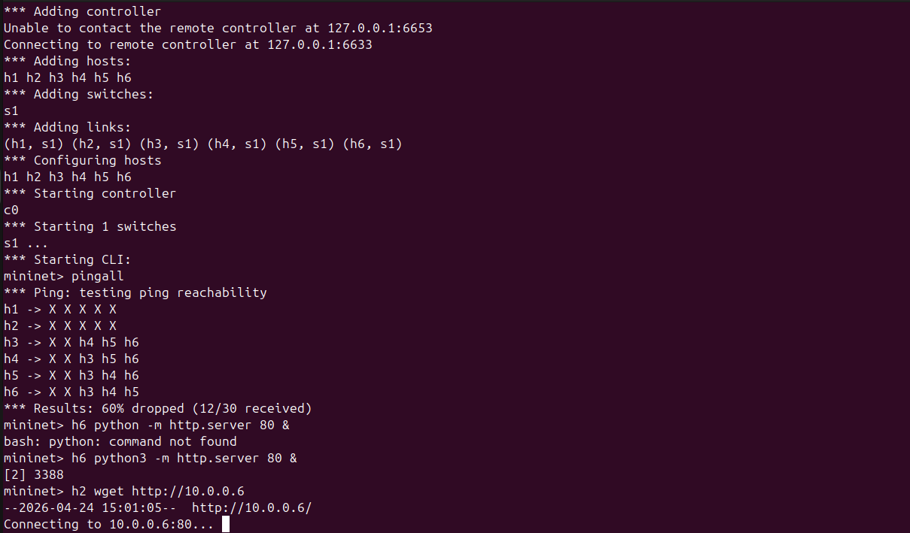
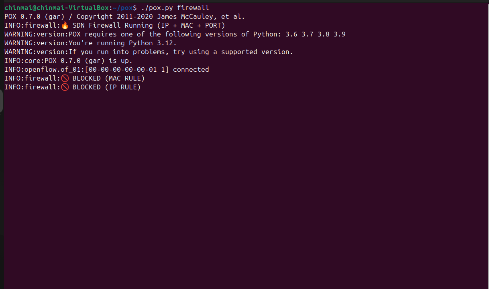

# 🔥 SDN-Based Firewall using POX

## 📌 Objective
To develop a controller-based firewall using Software Defined Networking (SDN) that performs rule-based filtering using:
- IP Address
- MAC Address
- Port Number (HTTP)

---

## 🛠 Tools Used
- Mininet (Network Emulator)
- POX Controller
- OpenFlow Protocol
- Python

---

## 🌐 Network Topology

A single-switch topology is used with 6 hosts.

- h1 → h6 connected to switch s1  
- Controller (POX) manages the switch  

### 📸 Topology Setup


This shows the Mininet network creation and successful connection to the controller.

---

## ⚙️ How It Works

1. A packet arrives at the switch  
2. If no rule exists → sent to controller  
3. Controller checks firewall rules  
4. If rule matches → installs DROP rule  
5. Future packets are blocked directly at switch  

---

## 🚫 Firewall Rules Implemented

- MAC Blocking → blocks specific host (h1)
- IP Blocking → blocks specific host (h2)
- Port Blocking → blocks HTTP traffic (port 80)

---

## 🧪 Testing & Results

### 📸 Ping Results (Allowed vs Blocked Traffic)


- Total connections tested = 30  
- Only 12 successful  
- 60% traffic blocked  

👉 Shows firewall is actively filtering traffic  

---

### 📸 Firewall Logs (Controller Output)


- Controller logs show:
  - MAC rule triggered  
  - IP rule triggered  

👉 Confirms rules are being applied dynamically  

---

### 📸 HTTP Blocking (Port Filtering)
- HTTP server started on h6  
- Access attempt from h2 using `wget`  

👉 Connection hangs / fails → indicates port 80 is blocked  

---

## 📊 Flow Rule Installation

The controller installs flow rules in the Open vSwitch:

```bash
sudo ovs-ofctl dump-flows s1"# Firewall-using-SDN" 
